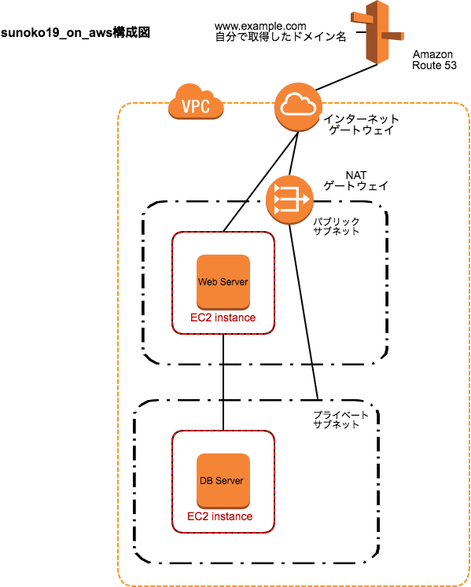

# Amazon Web Servicesネットワーク入門

# 概要
1. VPCにパブリックなサブネットとプライベートなサブネットを作成する
1. パブリックなサブネットにWebサーバー用EC2、プライベートなサブネットにDBサーバー用EC2を作成する。
  * Webサーバー：Apache、Wordpress
  * DBサーバー：Mysql
1. Webサーバーにインターネットからアクセスできるようにインターネットゲートウェイを設置する。
1. DBサーバーがインターネットに接続できるようにNATゲートウェイを設置する。 
# VPC
1. Region
1. ネームタグ（VPCの名前）
1. CIDR（割り当てるネットワークアドレス）
1. テナンシー（他のユーザーと共有するハードで実行される or 専有ハード）
# サブネット
1. ネームタグ（サブネットの名前）
1. VPC（対象のVPC）
1. 配置したいAvailability Zone
1. CIDR（指定したVPC領域のネットワークアドレスになるようにする）
# パブリックIPアドレスの割り当て
1. サブネットの自動割り当てパブリックIPを有効化
1. 反映されるのは有効化してから作成されるEC2のみ
# インターネットゲートウェイ
1. インターネットゲートウェイをVPCにアタッチ
# ルートテーブル
1. インターネットゲートウェイをデフォルトゲートウェイとしたルートテーブル作成
1. サブネットのルートテーブルを変更
# EC2
1. OSイメージ（AMI）
1. インスタンスタイプ
1. 配置するネットワーク（VPC、サブネット）
1. EBS（ストレージ）
1. セキュリティグループ
1. SSHキーペア
1. ネットワークインターフェイス確認（ENI）
# SSH接続
1. ssh -i mykey.pem ec2-user@パブリックIPアドレス
# セキュリティグループ、ネットワークACL
1. ネットワークACLでサブネット全体のセキュリティを構成（サブネット単位）VPCメニューで設定
1. 個々のEC2に対してセキュリティグループを構成（EC2単位）⇨EC2メニューで設定
1. 1つのENIに対して複数のセキュリティグループを割り当てられる
1. 1つのセキュリティグループを複数のEC2に割り当てられる
# プライベートなネットワーク
1. プライベートなサブネット作成
1. EC2配置
  1. scp -i mykey.pem mykey.pem ec2-user@パブリックIPアドレス:~/.ssh/
  1. chmod 600 ~/.ssh/mykey.pem
  1. ssh ec2-user@10.0.1.10 -i ~/.ssh/mykey.pem
# NATゲートウェイ構築
1. サブネット、Elastic IP（静的な固定パブリックIP）割り当て
1. private用ルートテーブル作成
 1. 0.0.0.0/0（デフォルトゲートウェイ）にNATゲートウェイを割り当てる
# Mysql
1. sudo yum install -y mysql-server
1. sudo service mysqld start
1. mysql -u root -p
1. create user 'wordpress' IDENTIFIED BY 'mypassword';
1. create database wordpressdb;
1. grant all privileges on wordpressdb.* to 'wordpress';
1. flush privileges;
1. sudo chkconfig mysqld on
# Wordpress
1. wget https://wordpress.org/latest.tar.gz
1. tar xzvf latest.tar.gz 
1. cp wp-config-sample.php wp-config.php
# EIP
パブリックIPは起動の度に動的に変わるので、運用しにくい
そのため固定のパブリックIPを設定する
1. OSから見えるIPは変わらない

