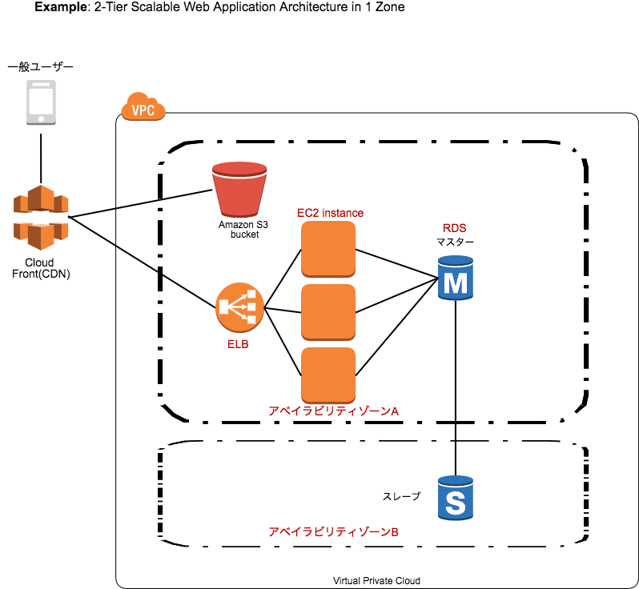
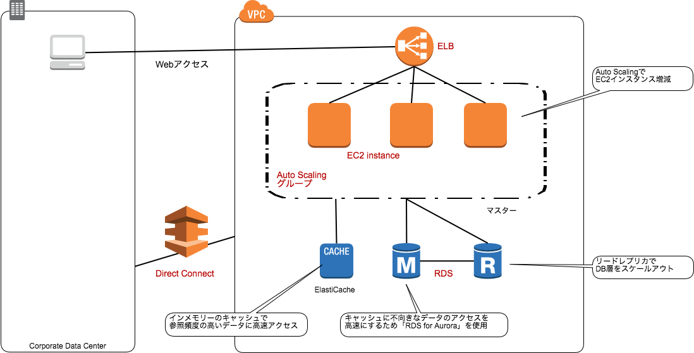
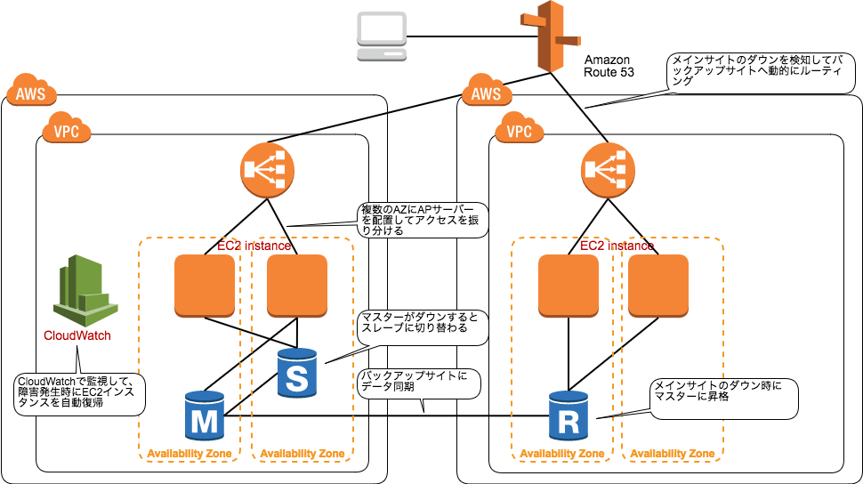
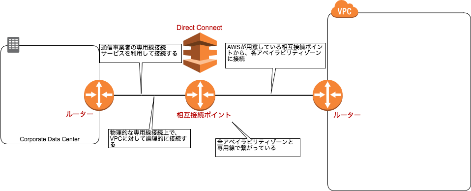
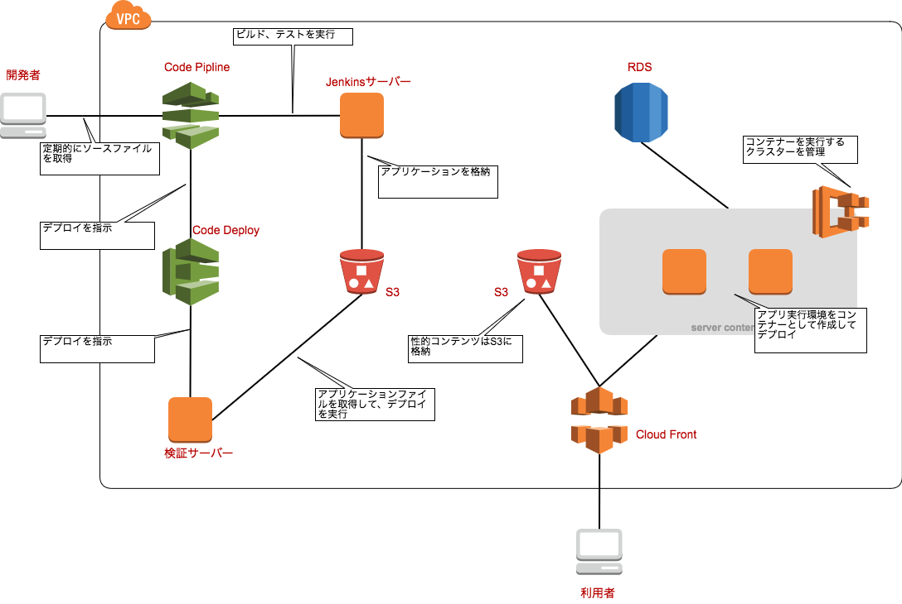

# Webシステム
## キャンペーンサイト
リソースの変更
* CPU,メモリー
    * EC2インスタンスの停止
    * インスタンスタイプの変更
* ディスク
    * EBS容量変更
## コーポレートサイト

## 性能重視

## 耐障害性

# ストレージシステム
## バックアップ
### S3にコマンドラインでファイル転送
### EC2にDRBDで同期
* DRBDでネットワーク越しにリアルタイムでブロックデバイスの内容を同期
* 十分な容量のEBSを準備
### Strage Gatewayを利用し、S3に自動バックアップ
* オンプレサーバーに専用ソフトを導入してAWSと接続する
### ログ、DBファイルなどの長期保管
* 格安ストレージサービスAmazon Glacierを使用
* 例えば、S3に格納⇨（3ヶ月後）⇨Glacierに格納⇨（5年後）⇨削除
### 重要なデータはDirect Connectで専用線接続

# アプリケーションの高速開発

# 料金
EC2
* 容量の保持に対して課金
EBS
* 容量の保持に対して課金
EIP
* EC2インスタンスに関連づけられている場合は課金されない
VPC
* 接続とデータ転送に対して課金
Route53
* そーん単位の月額課金